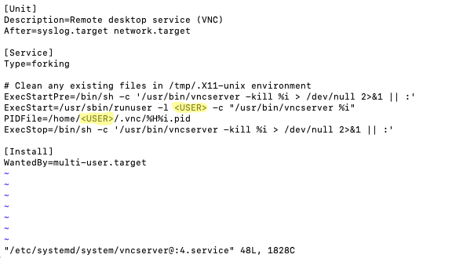
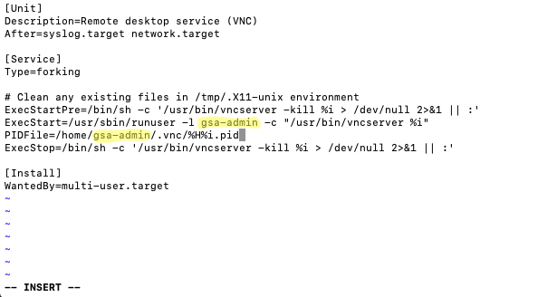
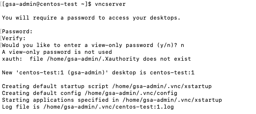
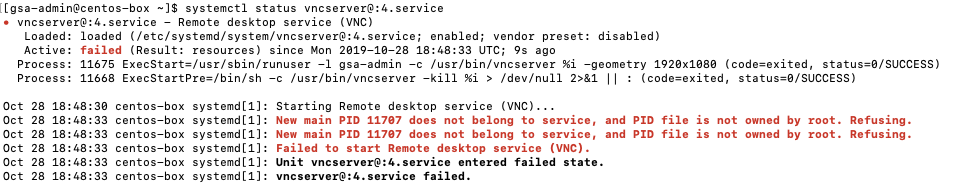
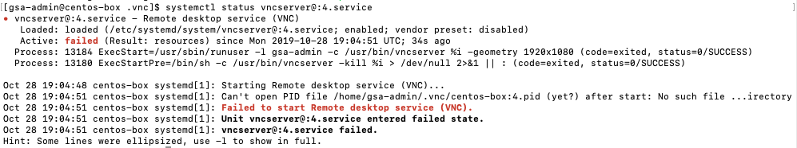
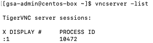

### Install / Configure the GNOME GUI and VNC Server

In this section we'll use the instance created in the first step: [Creating a Centos 7 Instance on GCP](Creating-Centos7-Instance-GCP.md), adding the GNOME Desktop GUI, and then move on to add a VNC server for remote access to the desktop. 

The reason I chose to use a Centos 7 server and adding the GNOME GUI was to provide a workstation where we could use the virt-manager (virtual machine manager) GUI to create and manage KVM virtual machines. In further sections, we'll cover installing and configuring the libraries needed to use the virtual machine manager on our Centos 7 instance. 

#### Installing GNOME Desktop GUI

Installing the GNOME GUI is fairly straight forward:

- Update YUM

   ```sudo yum update``` 

- Then install GNOME Desktop

   ```sudo yum groupinstall "GNOME Desktop" "Graphical Administration Tools"```
   
- Then enable the GUI on system startup. In Centos7, systemd uses "targets" instead of runlevel.

   ```ln -sf /lib/systemd/system/runlevel5.target /etc/systemd/system/default.target```
   
- Then restart the instance

   ```sudo restart```


#### Installing the VNC Server

VNC (Virtual Network Computing) Server allows you to access an instance using remote desktop sharing with VNC clients like VNC viewer. In Centos and RHEL 7, the package **tigervnc-server** needs to be installed in order to setup the VNC server. 

- Next install TigerVNC and other dependencies, here we're also adding *xorg-x11-fonts-Type1* support.

   ```sudo yum install tigervnc-server xorg-x11-fonts-Type1```
   
- Now we'll need to copy the VNC config file "/libsystemd/system/vncserver@.service" to the "/etc/systemd/system/vncserver@:[port-number].service". Note: when copying the VNC config, we also set a port number on which we want the VNC service listening to. In this example we'll specify port 4, which means the VNC server will be listening on port "5904". So when connecting to the VNC server, we can specify the port in two ways: [ip-address-vnc-server:**4**] or [ip-address-vnc-server:590**4**]. In the GCP firewall, leveraging the network tag we setup when creating the instance, we'll be allowing port **5904**. 

   ```sudo cp /lib/systemd/system/vncserver@.service /etc/systemd/system/vncserver@:4.service``` 

- Next, we need to update the user's information in the new port specific config file. 

   ```sudo vi /etc/systemd/system/vncserver@:4.service```
   
- Then replace *[USER]* highlighted below, with your chosen username. For this example I'm using the username "gsa-admin".

   Default "vncserver@:4.service" file

   
   
   Add your chosen username...
   
   
   
- After updating the VNC config for your user, we need to set the firewall rule if the firewall is enabled on your linux instance.

   ```
   sudo firewall-cmd --permanent --zone=public --add-port=5904/tcp
   sudo firewall-cmd --reload
   ```
   
- Next we'll set the VNC password for the user.

  If you are not currently running as this user, switch to your chosen user
  
  ```su - [your-chosen-user]```
  
  Example:
  
  ```su - gsa-admin```
  
  Then run the *vncserver* command to set the password as shown below...
  
     
     
- Now start and enable the VNC service at boot time. Execute the following commands as **root**.

   ```
   systemctl daemon-reload
   systemctl enable vncserver@:4.service
   systemctl start vncserver@:4.service
      
   ```
   
#### Gotchas (TigerVNC at least for Centos 7 in my experience is a bit quirky)

- When running the previous command:

   ```systemctl start vncserver@:4.service```
   
  or
  
  ```systemctl restart vncserver@:4.service```
  
  You will more than likely see an error message to the tune:
  
  *Job for vncserver@:4.service failed because a configured resource limit was exceeded. See "systemctl status vncserver@:4.service" and "journalctl -xe" for details.*
  
  When you execute the command to view the status, you'll see one of the following scenarios
  
  
  
  or
  
  
  
  However if you execute the following:
  
  ```vncserver -list```
  
  You'll notice you have started a VNC server on display port 1.
  
  
  
  This is misleading because it uses the display port :1, however it's using your configuration and listening on the display port you specified, in our case this is :4 or 5904, even though it gives you the error message mentioned above.
  
  At this point you should now be able to login with your VNC client using the IP address of your instance, and the port 5904.