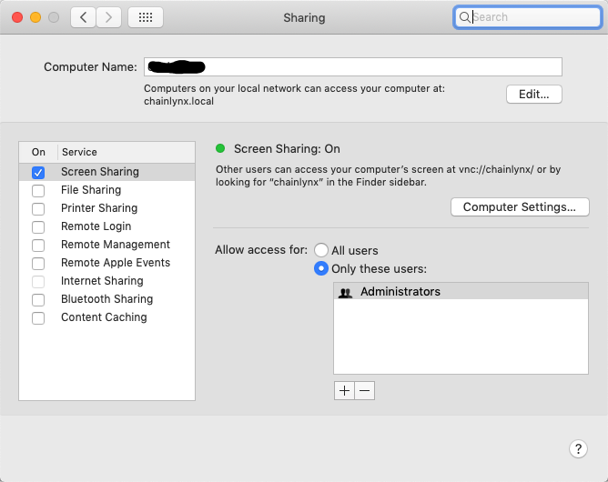
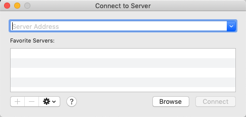

## Install / Configure the GNOME GUI and VNC Server

In this section we'll use the instance created in the first step: [Creating a Centos 7 Instance on GCP](Creating-Centos7-Instance-GCP.md), adding the GNOME Desktop GUI, and then move on to add a VNC server for remote access to the desktop. 

The reason I chose to use a Centos 7 server and adding the GNOME GUI was to provide a workstation where we could use the virt-manager (virtual machine manager) GUI to create and manage KVM virtual machines. In further sections, we'll cover installing and configuring the libraries needed to use the virtual machine manager on our Centos 7 instance. 

### Installing GNOME Desktop GUI

   Installing the GNOME GUI is fairly straight forward, but first switch to the root user on your centos instance

- First switch to the root user on your instance

  ```$ sudo su```
- Then make sure yum is up-to-date

  ```$ yum update```
- Install the GNOME Desktop and Admin Tools

  ```$ yum groupinstall "GNOME Desktop" "Graphical Administration Tools"```
- Enable the GUI on system startup. In Centos7, systemd uses "targets" instead of runlevel.

  ```$ ln -sf /lib/systemd/system/runlevel5.target /etc/systemd/system/default.target```
- Finally reboot your instance

  ```$ restart```


### Installing the VNC Server

   VNC (Virtual Network Computing) Server allows you to access an instance using remote desktop sharing with VNC clients like VNC viewer. In Centos and RHEL 7, the package **tigervnc-server** needs to be installed in order to setup the VNC server. 

- First switch into root

  ```$ sudo su```
- Then install tiger-vnc and other dependencies

  ```$ yum install -y tigervnc-server xorg-x11-fonts-Type1```
- Copy the VNC config file "/libsystemd/system/vncserver@.service" to the "/etc/systemd/system/vncserver@:[port-number].service". Note: when copying the VNC config, we also set a port number on which we want the VNC service listening to. In this example we'll specify port 4, which means the VNC server will be listening on port "5904". So when connecting to the VNC server, we can specify the port in two ways: [ip-address-vnc-server:**4**] or [ip-address-vnc-server:590**4**]. In the GCP firewall, leveraging the network tag we setup when creating the instance, we'll be allowing port **5904**. 

  ```$ cp /lib/systemd/system/vncserver@.service /etc/systemd/system/vncserver@:4.service```
- Next, we need to update the *[User]* tags in the new port specific config file.

  ```$ vi /etc/systemd/system/vncserver@:4.service```
- Replace *[User]* highlighted below, with your username. For this example I'm using the username "gsa-admin".

   Default "vncserver@:4.service" file

   
   
   Add/replace with your username...
   
   
   
- After updating the VNC config for your user, we need to set the firewall rule to allow the VNC connection. The following rule is set as per the port-offset mentioned above.

   ```
   sudo firewall-cmd --permanent --zone=public --add-port=5904/tcp
   sudo firewall-cmd --reload
   ```
- Next, switch back to your user, from root. In this instance I SSH'd into this box with the gsa-admin user, the same user I'm setting up the VNC server for, therefore you can simply exit the root user.

   ```$ exit```
  Then run the *vncserver* command to set the password as shown below...
  
     
     
- Now start and enable the VNC service at boot time.

   ```
   sudo systemctl daemon-reload
   sudo systemctl enable vncserver@:4.service
   sudo systemctl start vncserver@:4.service
      
   ```
   
#### Gotchas (TigerVNC at least for Centos 7 in my experience is a bit quirky)

- When running the previous command:

   ```systemctl start vncserver@:4.service```
   
  or
  
  ```systemctl restart vncserver@:4.service```
  
  You will more than likely see one of the following error messages:
  
  *Job for vncserver@:4.service failed because a configured resource limit was exceeded. See "systemctl status vncserver@:4.service" and "journalctl -xe" for details.*
  
  When you execute the command to view the status, you'll see one of the following scenarios
  
  
  
  or
  
  
  
  However if you execute the following:
  
  ```vncserver -list```
  
  You'll notice you have started a VNC server on display port 1.
  
  
  
  This is misleading because it uses the display port :1, however it's using your configuration and listening on the display port you specified, in our case this is :4 or 5904, even though it gives you the error message mentioned above.
  
  At this point you should now be able to login with your VNC client using the IP address of your instance, and the port 5904. Despite the error messages. I spent a bit of time trying to resolve the messages, however with the VNC server working to remote into your instance, I didn't want to spend more time on this. If anyone would like to send an update or solution to this, please do!
  
#### Your MAC has a VNC client built in, and easy to use!

- OS X has a built in VNC (Screen Sharing) server, but it is a little known feature that it also has a built in VNC client. No additional software is necessary.

   To setup the server go to Preferences -> Sharing, and check the “On” checkbox next to “Screen Sharing”. Make sure to only allow access to Administrators or a specific user/user group.

   
   
   To connect to your Centos7 instance, click on your desktop, or have the Finder menu bar at the top, and click on Go -> Connect to Server.
   
   
   
   Enter the VNC address of your instance in the format "vnc://[instance-ip-address]:5904", using the port we setup and provided access to above. 
   
   At this point you should be viewing the desktop of your Centos 7 desktop GUI. 
   
